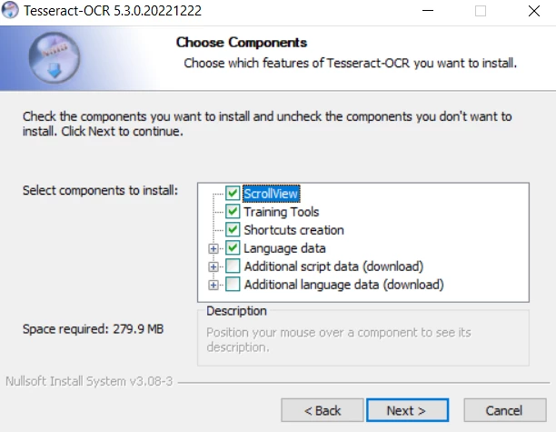
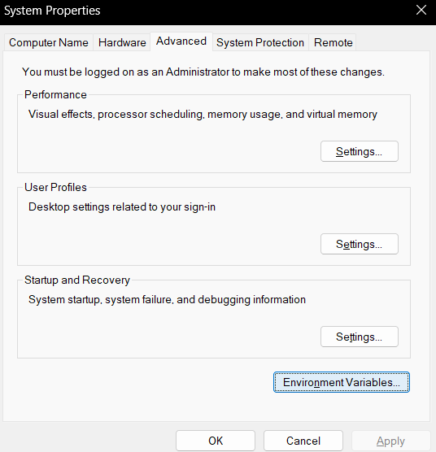
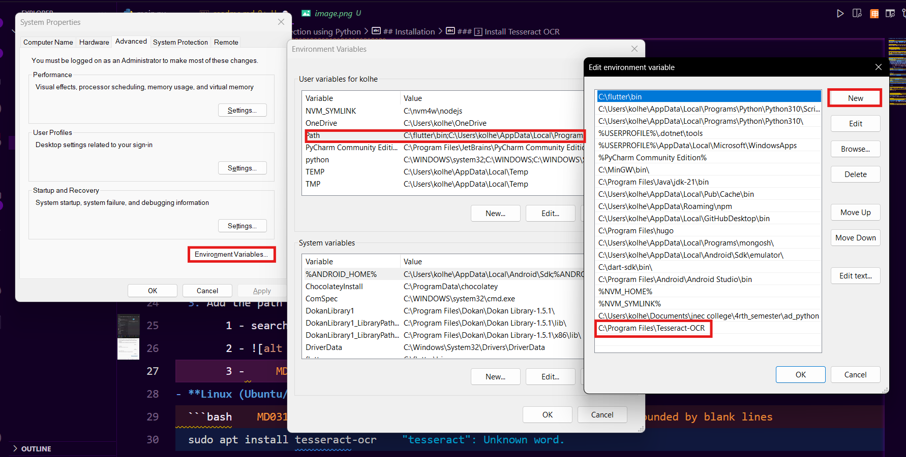
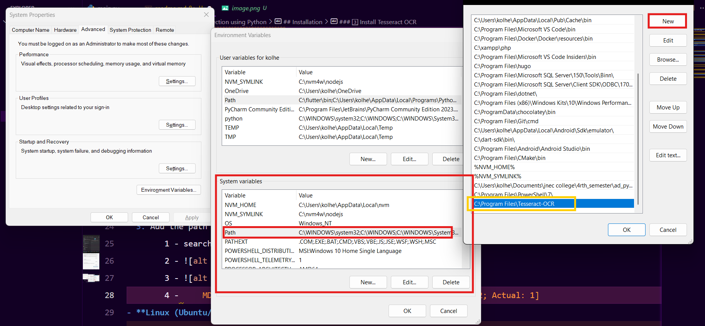

# Handwritten Text Detection using Python

## Overview
This project uses **Tesseract OCR** and **EasyOCR** to detect handwritten text from images. The script processes an image, extracts text using OCR models, and displays the results along with the image.

## Installation
Follow these steps to set up the project on your system.

### 1️⃣ Prerequisites
- Python 3.7 or higher
- A system with a **GPU (optional, but improves EasyOCR performance)**

### 2️⃣ Install Required Libraries
Run the following command to install the necessary dependencies:
```bash
pip install tensorflow keras opencv-python pytesseract easyocr numpy matplotlib
```

### 3️⃣ Install Tesseract OCR
Tesseract OCR is required for text recognition. Follow these steps:
- **Windows:**
  1. Download **Tesseract-OCR** from [here](https://digi.bib.uni-mannheim.de/tesseract/tesseract-ocr-w64-setup-5.3.0.20221222.exe)
  2. Install and note the installation path (e.g., `C:\Program Files\Tesseract-OCR`)
     1. while installation of Tesseract-OCR, when you will reach at this:-
        
        don't forget to tick the last two checkbox as well then move forward
  3. Add the path to your system environment variables
        1 - search for 
        2 - 
        3 - 
        4 - 

### 4️⃣ Verify Installation
To check if Tesseract is correctly installed, run:
```bash
tesseract --version
```
You should see a version number like `tesseract 5.x.x`.

## Usage

### 1️⃣ Run the Python Script
Replace `image_path` in the script with the path to your image, then execute:
```bash
python main.py
```

### 2️⃣ Expected Output
- **Tesseract OCR Result**
- **EasyOCR Result**
- The original image displayed with the title "Handwritten Text Detection"

## Credits
- **Tesseract OCR** (by Google)
- **EasyOCR** (by Jaided AI)
- **OpenCV** (for image processing)

## License
This project is open-source and free to use under the MIT License.